# 12.0(S1)探究死敵: 努萊厄斯
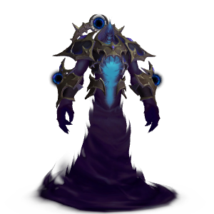
最後編輯時間: 2026/07/14

## 簡介
探究折磨高地，位於**虛無風暴(座標: 61.2 71.2)**。

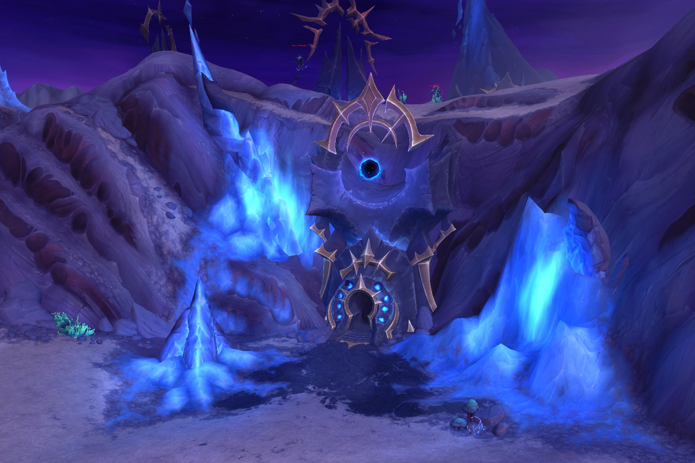

機制簡單，賽季初期挑戰的主要難點在於近戰攻擊 ，坦克或治療玩家明顯較有優勢。

?難度與??難度除了傷害與血量有差以外，機制幾乎沒有變化。??難度中技能**虛無空虛**若成功施法，玩家會受到秒殺傷害，**空無區域**的覆蓋會變得無縫接軌。

瓦麗拉設置為治療，能幫忙驅散dot**吞噬精華**和移除小怪的流血**鋸齒撕扯**。戰鬥珍品建議選擇**星辰披肩**，殘血時能提供護盾，同時擊飛周圍目標附帶易傷，通用珍品則選**時光佚失敕令**，機率刷新護罩，除了可提供護盾，還能提升移速、技能cd速度與施法速度，同時敵人在護罩內能受到相反效果。

## 指南
**虛無空虛**必斷。**吞噬精華**可被治療瓦麗拉驅散。

近戰攻擊造成6萬傷害(?難度)/12萬傷害(??難度)。**內爆打擊**為坦克專精挑戰時獨有技能，常規爆坦技。**虛無空虛**造成33萬傷害(?難度)/秒殺傷害(??難度)。

血量剩餘75%、50%、25%時轉階段，努萊厄斯施放

**寂滅護罩**

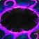
**寂滅護罩** 
*瞬發* 
努萊厄斯以虛無能量保護自身，受到的所有傷害降低100%。

，免疫所有傷害且無法被選中持續30秒，並引導**虛無球**新增一個持續至戰鬥結束的效果，同時召喚小怪。引導結束即會再次加入戰鬥，和小怪存活與否無關。

- 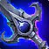**內爆打擊**: 
對目標造成高額傷害。  
(15碼/2.5秒施法/鋼條/物理傷害)
- **虛無空虛**: 
100碼aoe。  
(3秒施法/可打斷/暗影傷害)
- 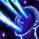**吞噬精華**: 
對目標施加dot，18秒內每2秒造成傷害。  
(50碼/2.5秒施法/鋼條/暗影傷害/可驅散)

### 第一次中場
召喚2隻**刃殼劫毀者**，飛撲技能**尖刺之躍**可被躲避。還擁有施加高額流血的技能**鋸齒撕扯**，該技能只有15碼，而且是點名最近目標，適當調整距離可規避或讓瓦麗拉承受。2隻不會同時放同個技能且受控制效果影響。

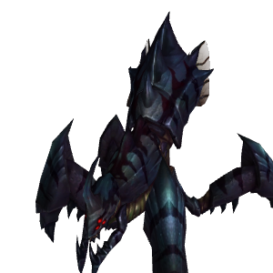

- 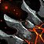**尖刺之躍**: 
於目標位置刷新4碼地板技，施法成功時飛躍至該處。  
(60碼/3秒施法/鋼條/自然傷害)
- 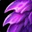**鋸齒撕扯**: 
對目標施加dot，每3秒造成傷害。  
(15碼/1.5秒施法/鋼條/物理傷害)

- 第一個**虛無球**效果：週期性以**空無區域**
覆蓋約1/3範圍場地，區域內每秒造成傷害。可能連續選擇同個區域覆蓋。

### 第二次中場
召喚7隻**吐液蜱**，會遠程對目標疊加**含毒噴吐**，可被控制效果影響。

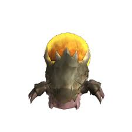

- 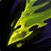**含毒噴吐**: 
對目標施加dot，8秒內每2秒造成傷害。  
(50碼/3秒施法/鋼條/自然傷害/可疊加)

- 第二個**虛無球**效果：刷新一個**重力井**，會移動的黑洞，50碼內玩家會持續受到吸引，引力會隨距離縮短而增加，中心區域每0.5秒造成傷害。

### 第三次中場
召喚1隻**被奴役的虛無法師**，血量有點高，會不斷施放**暗影箭**造成5萬傷害，偶爾還會施放**暗影暴擊**迫使玩家移動，以及詛咒技能**遲疑詛咒**。雖然前兩招皆可被打斷，但不建議這麼做，因為法師的近戰攻擊反而比較痛。

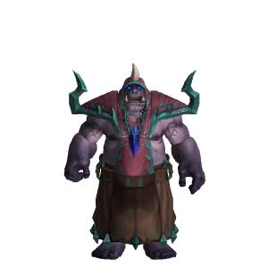

- 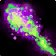**暗影箭**: 
對目標造成傷害。  
(60碼/2秒施法/可打斷/暗影傷害)
- 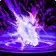**暗影暴擊**: 
於目標位置刷新地板技。  
(50碼/3秒施法/可打斷/暗影傷害)
- 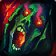**遲疑詛咒**: 
對目標施加詛咒，5分鐘內降低移速30%。  
(50碼)

- 第三個**虛無球**效果: 

**晦影之怒**

**晦影之怒** 
*瞬發* 
努萊厄斯被虛無能量超載，造成的所有傷害提高10%。此光環可堆疊。

，會週期性疊加增傷10%，需盡快結束戰鬥。若爆發傷害不足很容易出現同時面對法師和努萊厄斯的情況。由於法師血量高且免疫控制效果，建議此處開啟爆發，盡可能在30秒內擊殺法師。

## 獎勵
- 首次擊敗任意難度可獲得成就**我的陰暗宿敵**，獎勵頭部塑形**努萊厄斯多曼之眼**，以及**英雄晨曦紋章30個**，且似乎不計入賽季上限。
- 完成引導任務扼殺努萊厄斯可獲得玩具**壓倒性勝利**。
- 擊敗??難度的努萊厄斯可獲得成就**照亮黑暗**，獎勵頭銜『**惡兆**』。
- 達成於賽季期間獨自擊敗的條件，可額外獲得偉業**讓我單挑他: 努萊厄斯**，獎勵坐騎**秘虛傀儡**。
- 此外若為區域伺服器前4000名成功獨自擊敗的玩家，則額外獲得偉業**傳說級讓我單挑他: 努萊厄斯**，獎勵頭銜『**努萊厄斯傳奇鎮壓者**』。

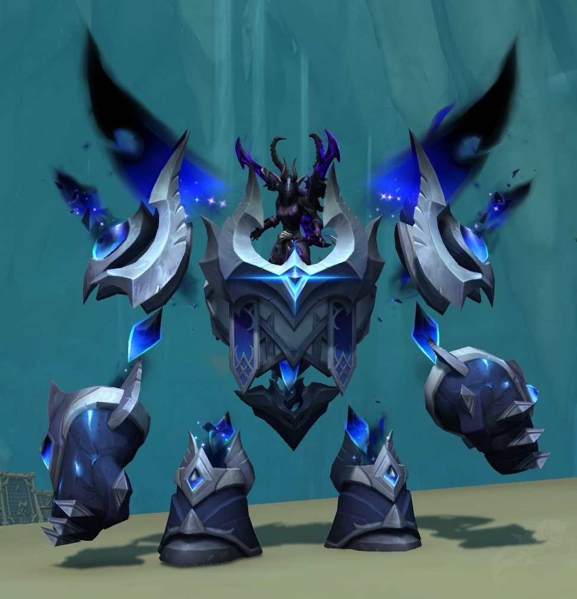

## 資料參考
- [Wowhead](https://www.wowhead.com/)
